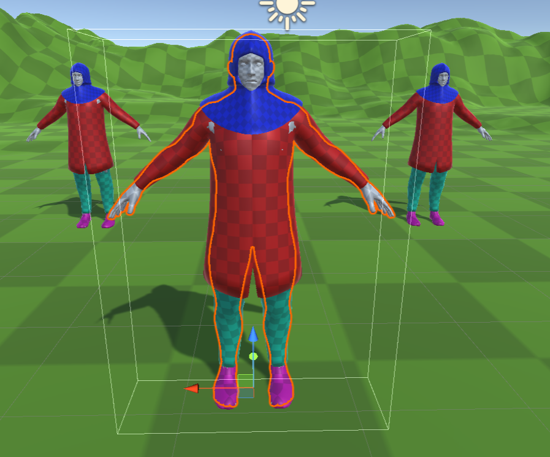
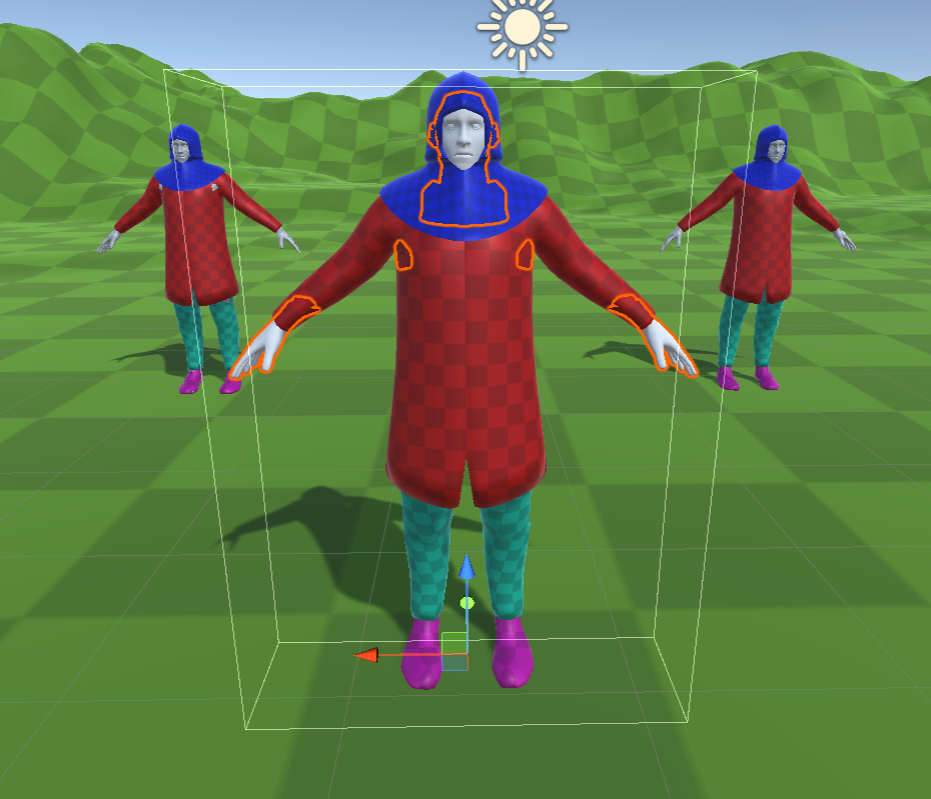
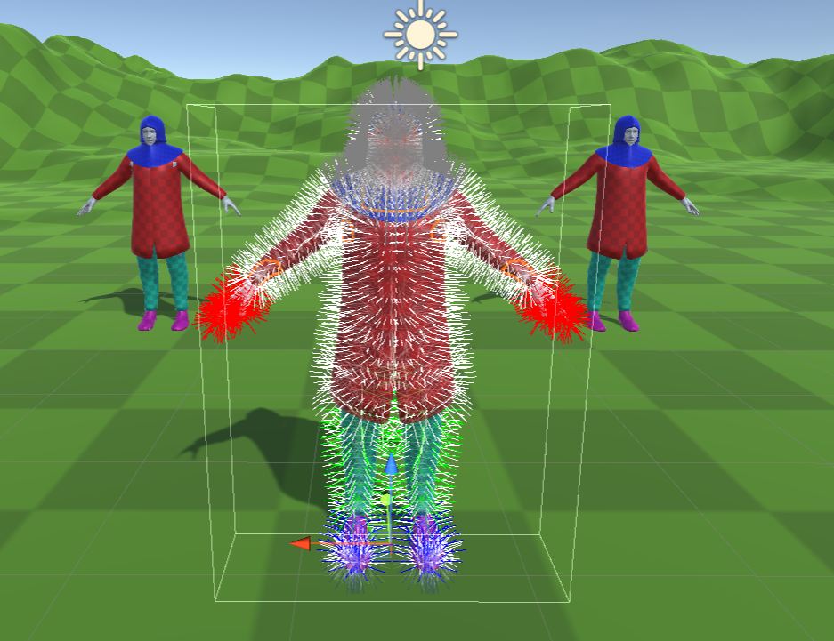

# Character Clipping Protector
A unity tool to reduce the amount of clipping between clothing layers and characters by hiding areas of the mesh which are occluded by outer layers.

## Required Packages
- Collections
- EditorCoroutines
- Jobs
- Burst











**Note: if duplicate unsafe.dll's are detected, reload vrchat sdk to fix**


Still getting error:

```
System.TypeInitializationException: The type initializer for 'Unity.Burst.Editor.BurstReflection' threw an exception. ---> UnityEditor.Compilation.PrecompiledAssemblyException: Multiple precompiled assemblies with the same name System.Runtime.CompilerServices.Unsafe.dll included or the current platform. Only one assembly with the same name is allowed per platform. Assembly paths:
Library/PackageCache/com.unity.collections@0.9.0-preview.6/System.Runtime.CompilerServices.Unsafe.dll
Packages/com.vrchat.base/Runtime/VRCSDK/Dependencies/Managed/System.Runtime.CompilerServices.Unsafe.dll
  at UnityEditor.Scripting.ScriptCompilation.EditorBuildRules.ValidateAndGetNameToPrecompiledAssembly (UnityEditor.Scripting.ScriptCompilation.PrecompiledAssembly[] precompiledAssemblies) [0x00151] in <a259d3c004024353a2c217da97495055>:0
  at UnityEditor.Scripting.ScriptCompilation.EditorBuildRules.ToScriptAssemblies (System.Collections.Generic.IDictionary`2[TKey,TValue] targetAssemblies, UnityEditor.Scripting.ScriptCompilation.ScriptAssemblySettings settings, UnityEditor.Scripting.ScriptCompilation.EditorBuildRules+CompilationAssemblies assemblies, System.Collections.Generic.HashSet`1[T] runUpdaterAssemblies) [0x00007] in <a259d3c004024353a2c217da97495055>:0
  at UnityEditor.Scripting.ScriptCompilation.EditorBuildRules.GetAllScriptAssemblies (System.Collections.Generic.Dictionary`2[TKey,TValue] allSourceFiles, System.String projectDirectory, UnityEditor.Scripting.ScriptCompilation.ScriptAssemblySettings settings, UnityEditor.Scripting.ScriptCompilation.EditorBuildRules+CompilationAssemblies assemblies, System.Collections.Generic.HashSet`1[T] runUpdaterAssemblies, UnityEditor.Scripting.ScriptCompilation.EditorBuildRules+TargetAssemblyType onlyIncludeType) [0x00137] in <a259d3c004024353a2c217da97495055>:0
  at UnityEditor.Scripting.ScriptCompilation.EditorCompilation.GetAllScriptAssemblies (UnityEditor.Scripting.ScriptCompilation.EditorScriptCompilationOptions options, UnityEditor.Scripting.ScriptCompilation.PrecompiledAssembly[] unityAssembliesArg, UnityEditor.Scripting.ScriptCompilation.PrecompiledAssembly[] precompiledAssembliesArg, System.String[] defines) [0x00076] in <a259d3c004024353a2c217da97495055>:0
  at UnityEditor.Scripting.ScriptCompilation.EditorCompilation.GetAllScriptAssemblies (UnityEditor.Scripting.ScriptCompilation.EditorScriptCompilationOptions options, System.String[] defines) [0x0001f] in <a259d3c004024353a2c217da97495055>:0
  at UnityEditor.Compilation.CompilationPipeline.GetEditorAssemblies (UnityEditor.Scripting.ScriptCompilation.EditorCompilation editorCompilation, UnityEditor.Scripting.ScriptCompilation.EditorScriptCompilationOptions additionalOptions, System.String[] defines) [0x00001] in <a259d3c004024353a2c217da97495055>:0
  at UnityEditor.Compilation.CompilationPipeline.GetAssemblies (UnityEditor.Scripting.ScriptCompilation.EditorCompilation editorCompilation, UnityEditor.Compilation.AssembliesType assembliesType) [0x0001e] in <a259d3c004024353a2c217da97495055>:0
  at UnityEditor.Compilation.CompilationPipeline.GetAssemblies (UnityEditor.Compilation.AssembliesType assembliesType) [0x00006] in <a259d3c004024353a2c217da97495055>:0
  at Unity.Burst.Editor.BurstReflection..cctor () [0x00030] in Library\PackageCache\com.unity.burst@1.4.11\Editor\BurstReflection.cs:617
   --- End of inner exception stack trace ---

  at Unity.Burst.Editor.BurstLoader..cctor () [0x00160] in Library\PackageCache\com.unity.burst@1.4.11\Editor\BurstLoader.cs:148
UnityEditor.EditorAssemblies:ProcessInitializeOnLoadAttributes (System.Type[])
```

Works very well, small issues with certain areas such as armpits as described below.

### Loading the Example:
- Download the project

- Open the Scene "Character Clipping Test Scene"

- Reset the meshes on the occlusion pawn to default

- Run the "Character Clipping Protector" - Check button - on "HumanMesh_WITHCLIPPINGPROTECTOR"

- Adjust the sliders for differing results

### Strengths:
- Fast - could be potentially used sparingly realtime depending on the mesh

- Good coverage - Gets most areas and flat/slightly rounded surfaces

### Weaknesses:
- Complex areas - Areas such as the armpits/ inner thighs can be an issue due to the huge variance in angles

- For large meshes will cause perforance isues

- Async- must be run in a coroutine

- Only setup for skinned meshes

### Usage:

- DO NOT RUN in any pose other than T or A pose - will get varying results

- Setup a specific layer for testing occlusion and set this in the script

- In editor use the "check" option as described above to run the simulation

- To run from code simply set the meshes and then start the RunClippingSimulation coroutine (with optional callback when complete)

- Adjust margin to add "safety" margins where the edges of the mesh occur

### Tips:
- ORDER MESHES in terms of layer with the lowest priority first in the inspector (see example)

- Split meshes up if required: The script will do a reasonable job on all areas but manual culling could be required in certain situations (split arms/legs/torso/head etc)

- Calculate all mesh combinations upfront in a loading phase and store the results with the "Caching" feature - will then allow quick culling later during gameplay

### Method:
- Creates a seperate collider mesh to test against for each mesh

- Uses the new Raycast command to cast for each vertex on each mesh from the outside in

- Collects results and processes to find areas with overlap

- Creates a new mesh and hides areas with signigicant overlap

### Debugging:
- Use the debug options on the tool to show either mesh hits (overlapping zones) or every raycast made.


